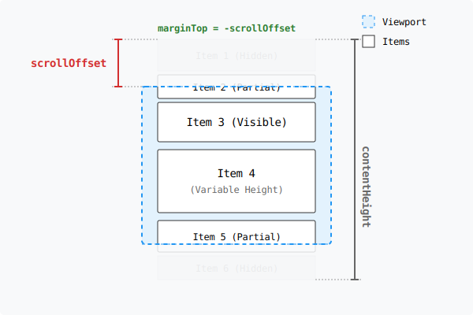
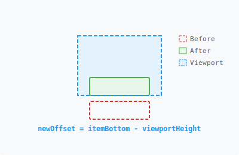
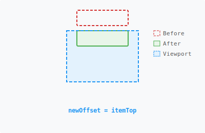
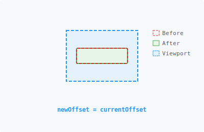
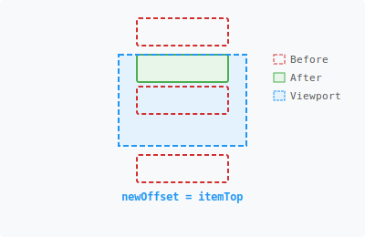
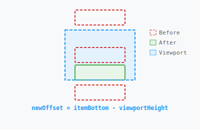
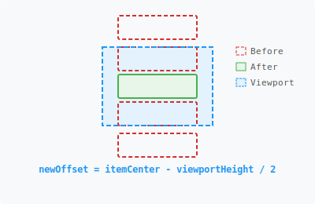

We're excited to announce the release of **ink-scroll-view**, a new open-source library that brings smooth, glitch-free scrolling to terminal applications built with [Ink](https://github.com/vadimdemedes/ink).

## Why We Built This

If you've ever tried to build a CLI tool with Ink, you've likely hit a wall: **there's no built-in way to scroll content**. Ink gives you powerful React primitives like `<Box>` and `<Text>`, but when your content exceeds the terminal height, you're on your own.

We needed a reliable scrolling solution for our own CLI tools, so we built one — and now we're sharing it with the community.

**ink-scroll-view** provides:

- 🚀 **High-performance scrolling** — Uses a "negative margin" technique instead of string slicing, minimizing re-renders
- 🎯 **Smart alignment** — Scroll to any item with `auto`, `top`, `center`, or `bottom` alignment
- 📐 **Dynamic content support** — Handles variable-height items and runtime content changes seamlessly
- ⚡ **Zero flicker** — Smooth scrolling without visual glitches

## The Engineering Challenges

Building a scroll view in a CLI environment presents unique constraints compared to the web:

1.  **No Native "Scroll" Property**: Terminal buffers are linear streams. You cannot simply set `scrollTop = 100`. To "scroll", you must fundamentally alter _what_ text is sent to the output buffer.
2.  **Layout Dependency**: To scroll correctly, you need to know the precise height of the content _before_ you decide which slice of it to show. However, in React, layout measurements usually happen _after_ the render commit phase.
3.  **Clipping**: You need to mask content that is "out of view" without breaking the layout calculations of the content that _is_ in view. Simply not rendering the children means their dimensions cannot be measured.

## The Solution: The "Negative Margin" Viewport

Our solution leverages Ink's exposure of Yoga layout metrics combined with a classic "sliding window" technique.

### 1. Visualizing the Architecture

Instead of manually slicing strings, we render the _entire_ content list but shift its position vertically within a clipped container.



The implementation relies on three nested layers:

1.  **Viewport (Outer Box)**: Fixed `height`, `overflowY: "hidden"`. This clips content.
2.  **Container (Inner Box)**: `marginTop: -scrollTop`. This shifts content up.
3.  **Items**: The actual content.

The Layout Engine (Yoga) calculates the positions of _all_ items. Ink then renders the Container shifted upwards. The Viewport discards any lines that physically fall outside its 0 to `height` range.

### 2. Reactivity: Handling Dynamic Content

In a terminal, window resizing and dynamic data loading are common. If the data changes (e.g., a log line is added) or the component changes size (e.g., an accordion expands), the scroll position must remain valid.

**The Challenge:** React renders first, _then_ Ink/Yoga calculates layout. We don't know the height of an item until _after_ it has been rendered to the virtual DOM.

**The Solution:**

1.  **Initial Measurement**:
    Every direct child is wrapped in a `MeasurableItem` component that hooks into Ink's `measureElement` to report its height.

    ```tsx
    useLayoutEffect(() => {
      const { height } = measureElement(ref.current);
      onMeasure(index, height);
    }, [width, children]); // Re-run if width or content changes
    ```

2.  **Responding to Dynamic Changes**:
    Content and layout can change at runtime. Two APIs handle re-measurement:

    - `remeasure()`: Call this when the ScrollView's container size changes (e.g., terminal resize). Items re-layout automatically, but ScrollView needs this trigger to recalculate.
    - `remeasureItem(index)`: Call this when a specific item's content changes. This notifies ScrollView to re-measure that item.

3.  **Bounds Clamping**:
    Whenever item heights update, we recalculate `maxScroll` (`totalContentHeight - viewportHeight`). If the current scroll position becomes invalid (e.g., items were deleted), we automatically clamp it to a valid range.

### 3. Smart Scrolling: Alignment Strategies

A critical feature of `ScrollList` is its ability to intelligently scroll to an item. We support four alignment modes: `auto`, `top`, `bottom`, and `center`.

#### Mode: `auto` (Default)

The "least intrusive" scroll.

**If the item is below the viewport**, we scroll just enough to show it at the **bottom**:



**If the item is above the viewport**, we scroll just enough to show it at the **top**:



**If it's already visible**, we do nothing:



#### Forced Alignments

Sometimes you want precise control, like centering a search result or jumping to the top of a list.

**`top`**: Always align item to the top of the viewport.



**`bottom`**: Always align item to the bottom of the viewport.



**`center`**: Always align item to the center of the viewport.



**The Algorithm:**

1.  **Get Metrics**: Retrieve the `top`, `height`, and `bottom` of the target item relative to the full content list.
2.  **Apply Logic**: Calculate the new `scrollOffset` based on the chosen alignment strategy as visualized above.
3.  **Clamp**: Ensure the new offset is within valid bounds (`0` to `maxScroll`).

## Summary

`ink-scroll-view` bridges the gap between web-like development DX and the constraints of terminal rendering.

- It uses **negative margins** to emulate scrolling.
- It performs **O(1)** lookups for item positioning to handle navigation efficiently.
- It uses **reactive measurement hooks** to support dynamic content and variable-height items seamlessly.

By solving these low-level engineering problems, developers can focus on building rich, interactive CLI tools.
